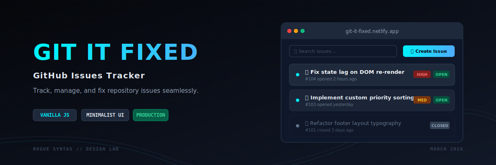
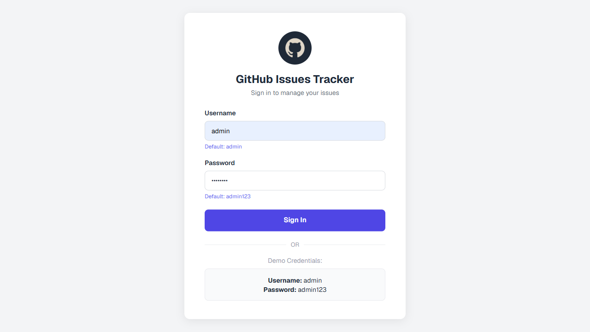
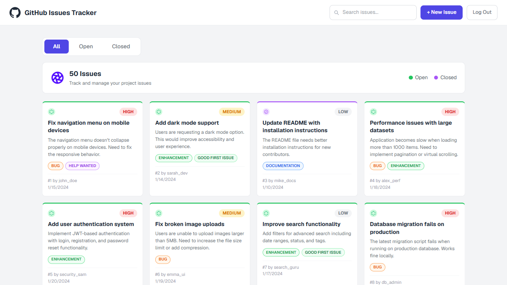
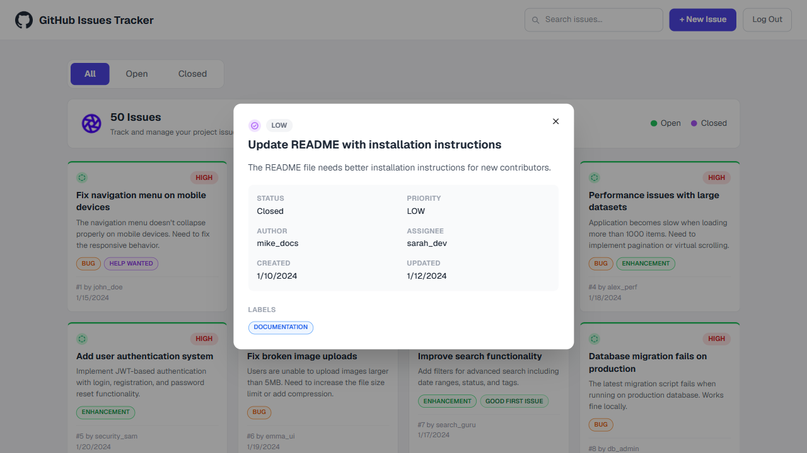

<!-- HEADER IMAGE -->
<p align="center">
  
</p>

<div align="center">

# 🐙 Git It Fixed — GitHub Issues Tracker

### A sleek, front-end issue tracker inspired by GitHub Issues — built with pure HTML, CSS & JavaScript.

[](https://developer.mozilla.org/en-US/docs/Web/HTML)
[](https://developer.mozilla.org/en-US/docs/Web/CSS)
[](https://developer.mozilla.org/en-US/docs/Web/JavaScript)
[](https://tailwindcss.com/)
[](https://daisyui.com/)
[](https://git-it-fixed.netlify.app/)
[](./LICENSE)

**[🚀 Live Demo](https://git-it-fixed.netlify.app/) · [🐛 Report a Bug](../../issues) · [✨ Request a Feature](../../issues)**

</div>

---

## 📖 Table of Contents

- [About the Project](#-about-the-project)
- [Features](#-features)
- [Live Demo](#-live-demo)
- [Screenshots](#-screenshots)
- [Tech Stack](#-tech-stack)
- [Getting Started](#-getting-started)
- [Project Structure](#-project-structure)
- [Roadmap](#-roadmap)
- [License](#-license)
- [Author](#-author)

---

## 🧭 About the Project

**Git It Fixed** is a front-end web application that recreates the core experience of **GitHub Issues** — letting users browse, filter, search, and create issues through a clean, modern dashboard. It was built to sharpen real-world front-end skills: DOM manipulation, dynamic rendering, state handling, and building a polished, responsive UI entirely with **vanilla JavaScript** — no frameworks involved.

The result is a fast, lightweight, and visually appealing issue-tracking interface that feels close to the real thing. ✨

> 💡 This project uses a mock data source to simulate issue data. [Mock Data](https://phi-lab-server.vercel.app/api/v1/lab/issues)

---

## ⚡ Features

- 🔐 **Login Flow** — simple authentication gate before accessing the dashboard
- 📋 **Issue Dashboard** — clean, card-based layout for browsing all issues
- 🗂️ **Smart Filtering** — quickly switch between **All / Open / Closed** issues via tabs
- 🔍 **Live Search** — instantly filter issues as you type
- ➕ **Create New Issues** — modal form to add issues with title, description, priority, status, and labels
- 🔎 **Issue Detail View** — click into any issue for a focused, detailed modal view
- 💀 **Skeleton Loaders** — polished loading states for a smoother perceived experience
- 🔔 **Toast Notifications** — real-time feedback for actions like creating an issue
- 📱 **Fully Responsive** — looks great on desktop, tablet, and mobile
- 🎨 **Modern UI** — styled with Tailwind CSS & DaisyUI for a clean, professional look

---

## 🌐 Live Demo

🔗 **[https://git-it-fixed.netlify.app/](https://git-it-fixed.netlify.app/)**

**Demo Credentials:**

| Field    | Value      |
| -------- | ---------- |
| Username | `admin`    |
| Password | `admin123` |

---

## 🖼️ Screenshots

<div align="center">

|           Login Page            |             Dashboard              |
| :-----------------------------: | :--------------------------------: |
|  |  |

|                New Issue Modal                 |             Issue Detail View             |
| :--------------------------------------------: | :---------------------------------------: |
|  |  |

</div>

> 📌 Replace the placeholders above with actual screenshots or a demo GIF of the app in action — this section makes a huge visual impact on your README!

---

## 🛠️ Tech Stack

| Technology                                                                                           | Purpose                                    |
| ---------------------------------------------------------------------------------------------------- | ------------------------------------------ |
|                       | Page structure & markup                    |
|                          | Custom styling                             |
|        | App logic, DOM manipulation, interactivity |
|  | Utility-first responsive styling           |
|                 | Prebuilt Tailwind component library        |
|                 | Hosting & deployment                       |

---

## 🚀 Getting Started

Since this is a static front-end project, running it locally is quick and simple.

### Prerequisites

- A modern web browser (Chrome, Firefox, Edge, etc.)
- (Optional) [VS Code](https://code.visualstudio.com/) with the **Live Server** extension for the best local dev experience

### Installation

```bash
# 1. Clone the repository
git clone https://github.com/SinghRohan333/git-it-fixed.git

# 2. Navigate into the project folder
cd git-it-fixed

# 3. Open index.html in your browser
#    — or right-click index.html → "Open with Live Server" in VS Code
```

That's it — no build tools, no dependencies to install. 🎉

---

## 📁 Project Structure

```
git-it-fixed/
├── assets/               # Images, icons & static assets
├── index.html            # Main HTML entry point
├── style.css             # Custom CSS styles
├── tailwind.init.css     # Tailwind CSS configuration/output
├── scripts.js            # Core application logic (JavaScript)
├── LICENSE                # MIT License
└── README.md              # Project documentation
```

---

## 🗺️ Roadmap

- [ ] Connect to a real backend / database for persistent issues
- [ ] Add user roles & real authentication
- [ ] Add issue comments & activity timeline
- [ ] Dark mode toggle
- [ ] Drag-and-drop status board (Kanban-style)

Have an idea? Feel free to [open a feature request](../../issues)! 💡

---

## 📄 License

This project is licensed under the **MIT License** — see the [LICENSE](./LICENSE) file for details.

---

## 👤 Author

**Rohan Singh**

- GitHub: [@SinghRohan333](https://github.com/SinghRohan333)
- LinkedIn: _add your link here_
- Portfolio: _add your link here_

<div align="center">

### ⭐ If you found this project interesting, consider giving it a star!

</div>
